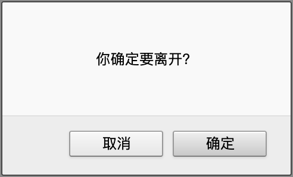

## 如何使用react-router自定义confirm

使用 React 框架在做后台管理系统的时候经常会遇到编辑页面跳出询问的情况，react-router-dom 提供了 Prompt 组件

```js
<Prompt when={true} message="Are you sure you want to leave?" />
```

来解决路由切换的问题，但是默认的实现的方式是利用`window.confirm(message)`弹出浏览器询问框如下

Firfox 浏览器询问


Chrome 浏览器询问


显然这种丑陋且不统一的 ui 风格是不能够让产品满意的，他们更希望是类似于 Antd 的`Modal.confirm`的样式风格，所以我们能不能基于 react-router 进行路由拦截定制自己的`Prompt`组件呢？

理论上基于`beforeunload`事件，显然是可以自定义的。带着这个问题我们去查看 react-router 的官方文档，我们可以在每个 Router 组件下面找到这样一个属性：

- getUserConfirmation: func
  A function to use to confirm navigation. Defaults to using window.confirm.

意思就是我们可以通过这个属性结合`Prompt`组件实现自定义 confirm

```jsx
<HashRouter
  getUserConfirmation={(message, callback) => {
    const allowTransition = window.confirm(message);
    callback(allowTransition);
  }}
/>
```
getUserConfirmation属性接受一个函数，mesasage和callback作为参数传递，这里官方文档并没有对这个属性做具体介绍，他是由`history`这个库提供的一个api,在路由跳转前执行，mesasage参数只能接受字符串，其值就是来自`Prompt`的message属性值，callback是一个函数，接受一个boolean值，默认当传入参数为true的时候才会执行路由切换。

那么我们就可以基于getUserConfirmation 和Prompt 完成自定义的congirm，代码如下

```jsx
 <Suspense fallback={"加载中..."}>
        <HashRouter
          getUserConfirmation={(result, callback) => {
            // result是message 执行的结果
            Modal.confirm({
              content: result,
              okText: "确认",
              cancelText: "取消",
              onOk: () => callback(true),
              onCancel: () => callback(false),
            });
          }}
        >
          <Link to="/">
            <Button type="primary" style={{ marginRight: 20 }}>
              Home
            </Button>
          </Link>

          <Link to="/edit">
            <Button>Edit</Button>
          </Link>

          <Switch>
            <Route exact path="/">
              <h2>Home</h2>
            </Route>
            <Route path="/edit">
              <div>
                <h2>Edit</h2>
                <Prompt
                  when={true}
                  message={(location, action) => {
                    return "你确定要离开？";
                  }}
                />
              </div>
            </Route>
          </Switch>
        </HashRouter>
      </Suspense>
```

[git链接](https://github.com/ChrisSong1994/react-router-prompt-test)